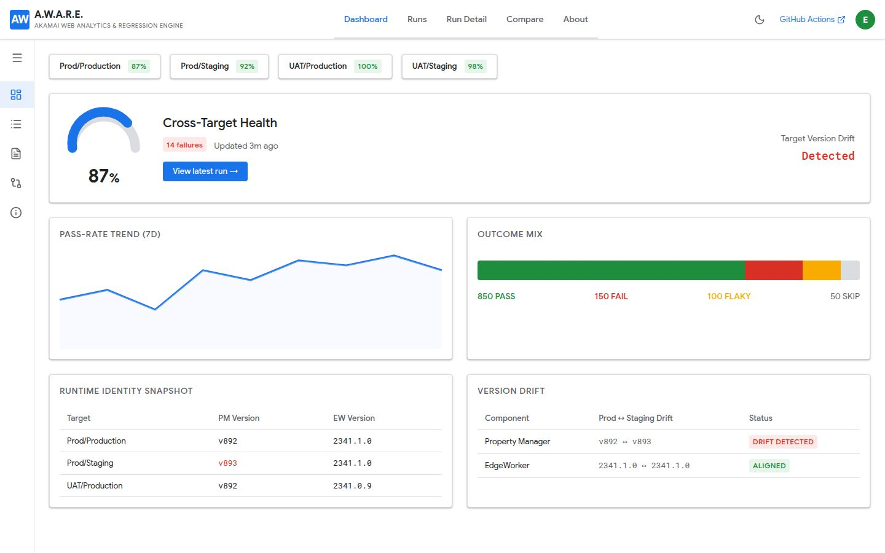
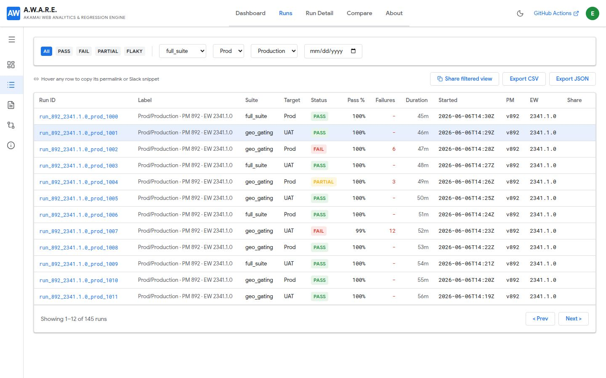
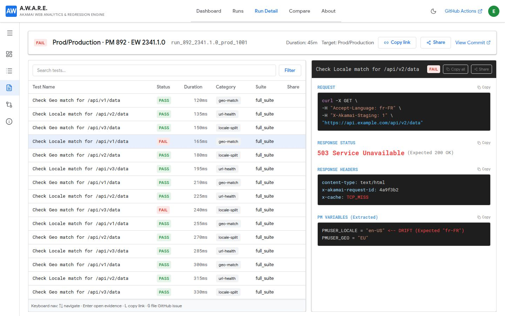
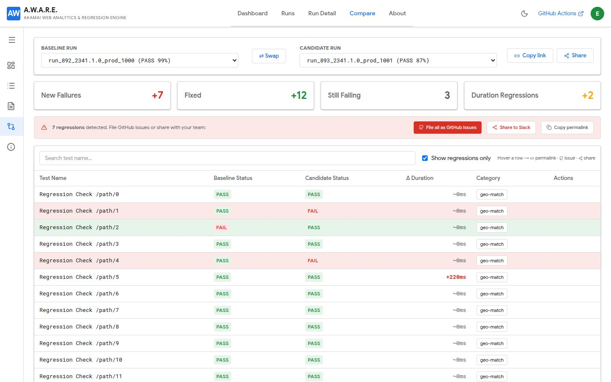
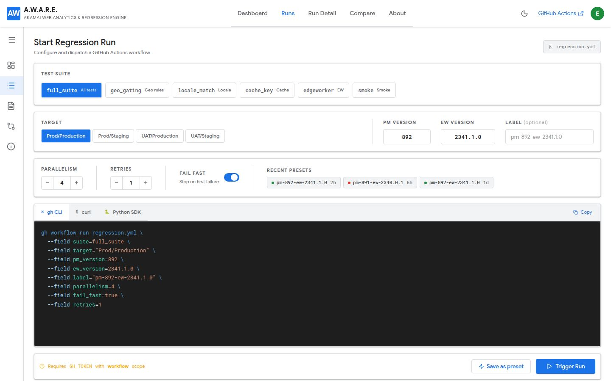
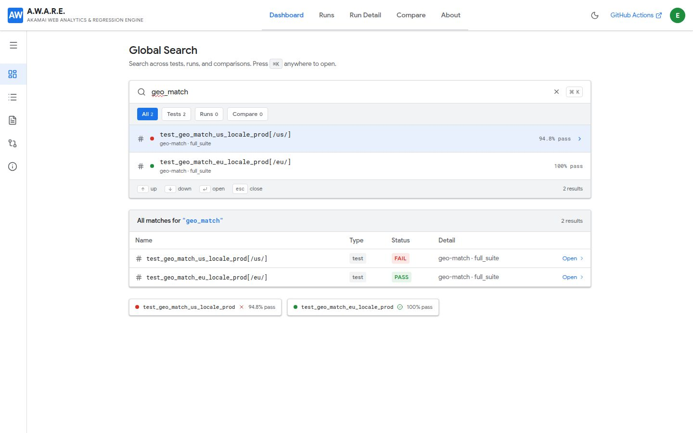
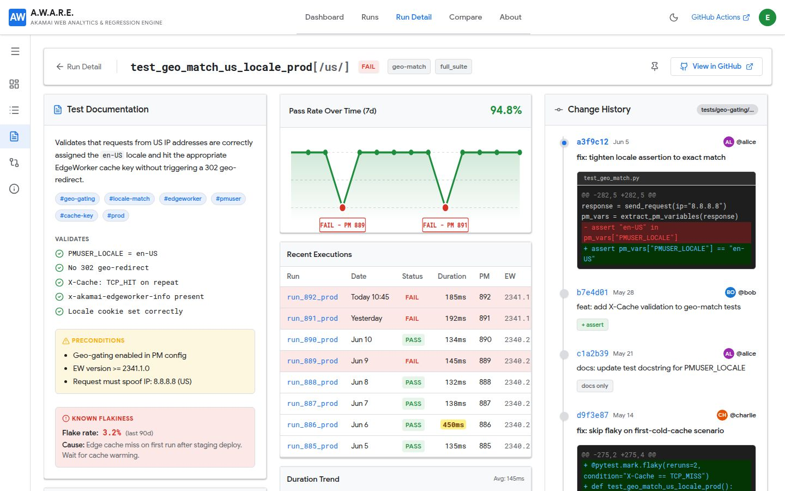
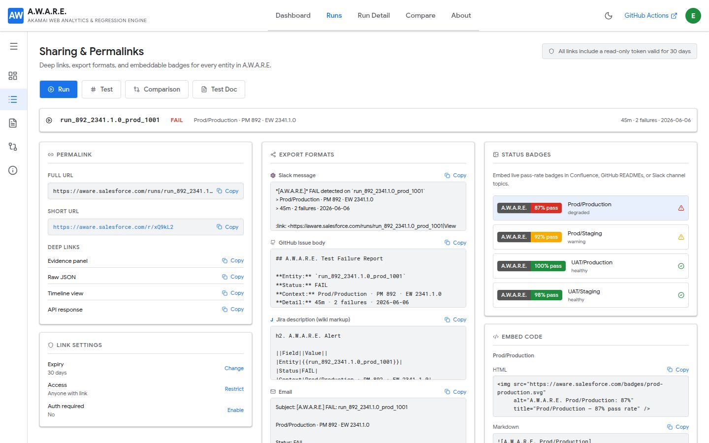

# A.W.A.R.E. — Akamai Web Analytics & Regression Engine

[](LICENSE)

**A.W.A.R.E.** is an open-source edge regression observability platform for Akamai CDN configurations. It helps teams make informed release decisions by providing structured, versioned, longitudinal signal correlation across property manager versions, EdgeWorker versions, and test outcomes.

Originally designed for Salesforce.com's WWW edge infrastructure, A.W.A.R.E. works with any Akamai property.

## Key Features

- **Regression Dashboard** — Per-target pass-rate gauges, trend charts, outcome mix visualization, and Akamai version drift detection
- **Run Management** — Browse run history, drill into individual run details with full test evidence
- **Comparison View** — Baseline vs. candidate run comparison with regression/fix/duration-change detection
- **Test Evidence Capture** — HTTP headers, cookies, cache keys, PM variables, EdgeWorker versions per test
- **Immutable Reports** — JSON reports committed to a dedicated branch, built into a static SPA served via GitHub Pages
- **Multi-Target** — Supports prod/production, prod/staging, UAT/production, UAT/staging environments
- **Dark Mode** — GCP-inspired light/dark themes

## Screenshots

### Dashboard
Cross-target health gauge, 7-day pass-rate trend, outcome mix bar, runtime identity snapshot, and version drift detection — all on one page.



---

### Run History
Filterable run table with status pills, inline share/permalink actions on row hover, and one-click CSV / JSON export.



---

### Run Detail
Split-pane view: test list on the left, full HTTP evidence (request, response status, headers, PM variables) on the right. Keyboard navigable.



---

### Regression Comparison
Baseline vs. candidate selector, delta scorecards (new failures / fixed / still failing / duration regressions), bulk GitHub issue filing, and per-row share actions.



---

### Start a Run
Suite pills, segmented target selector, PM/EW version inputs, parallelism/retries steppers, fail-fast toggle, and a live-updating tabbed command block (gh CLI · curl · Python SDK) — everything visible without scrolling.



---

### Global Search
⌘K command palette with faceted tabs (Tests · Runs · Compare), pass-rate inline, and keyboard navigation.



---

### Test Documentation
Per-test deep-dive: docstring, tags, preconditions, known flakiness, 7-day pass-rate sparkline, recent execution history, and full git change history with inline diffs.



---

### Sharing & Permalinks
Permalink builder with short-URL, deep links (evidence panel / raw JSON / timeline / API), expiry and access controls, pre-formatted export blocks for Slack / GitHub / Jira / Email, embeddable SVG status badges, and HTML/Markdown embed snippets.



## Architecture

```
┌──────────────────────────────────────────────────────────┐
│  GitHub Actions                                          │
│  ┌─────────────┐  ┌───────────┐  ┌────────────────────┐ │
│  │ pytest       │  │ Playwright│  │ merge_pytest_      │ │
│  │ (geo-gating, │  │ (forms)   │  │ reports.py         │ │
│  │ URL health)  │  │           │  │                    │ │
│  └─────────────┘  └───────────┘  └────────────────────┘ │
│                        │                                      │
│                        ▼                                      │
│              ┌─────────────────┐                              │
│              │  Normalize &    │                              │
│              │  Commit JSON    │                              │
│              │  to `results`   │                              │
│              │  branch         │                              │
│              └─────────────────┘                              │
└──────────────────────────────────────────────────────────┘
                        │
                        ▼
┌──────────────────────────────────────────────────────────┐
│  GitHub Pages                                            │
│  ┌────────────────────────────────────────────────────┐ │
│  │  Static SPA (React + Tailwind + shadcn/ui)          │ │
│  │  ├─ Dashboard (pass rate, trends, version drift)    │ │
│  │  ├─ Run History & Detail                            │ │
│  │  ├─ Comparison View                                 │ │
│  │  └─ Start Run / Search                              │ │
│  │  Reads immutable JSON from `pages` branch           │ │
│  └────────────────────────────────────────────────────┘ │
└──────────────────────────────────────────────────────────┘
```

The platform is **stateless by design** — no server-side database for the reporting layer. All test results are committed as structured JSON files to a `results` branch, then built into a static SPA deployed to GitHub Pages.

## Tech Stack

| Layer | Technology |
|-------|-----------|
| **Runtime** | Node.js 24 |
| **Language** | TypeScript 5.9 (strict) |
| **Package Manager** | pnpm workspaces |
| **API Server** | Express 5 |
| **Database** | PostgreSQL + Drizzle ORM |
| **Frontend** | React 19, Vite 7, Tailwind CSS 4, shadcn/ui |
| **Validation** | Zod, drizzle-zod |
| **API Codegen** | Orval (OpenAPI → React Query + Zod) |
| **Build** | esbuild (server), Vite (frontend) |
| **CI/CD** | GitHub Actions |

## Getting Started

### Prerequisites

- Node.js 24
- pnpm

### Setup

```bash
pnpm install
pnpm run build
```

### Development

```bash
# API server (port 5000)
pnpm --filter @workspace/api-server run dev

# Mockup sandbox (UI preview)
pnpm --filter @workspace/mockup-sandbox run dev

# Typecheck all packages
pnpm run typecheck
```

### Code Generation

```bash
# Regenerate API hooks and Zod schemas from OpenAPI spec
pnpm --filter @workspace/api-spec run codegen

# Push DB schema changes (dev only)
pnpm --filter @workspace/db run push
```

### Environment Variables

| Variable | Description |
|----------|-------------|
| `DATABASE_URL` | PostgreSQL connection string |
| `PORT` | API server port (default: 5000) |

## Project Structure

```
├── artifacts/
│   ├── api-server/          # Express 5 API server
│   └── mockup-sandbox/      # React UI preview sandbox
├── lib/
│   ├── api-client-react/    # Generated React Query hooks (Orval)
│   ├── api-spec/            # OpenAPI 3.1 spec + Orval config
│   ├── api-zod/             # Generated Zod schemas (Orval)
│   └── db/                  # PostgreSQL + Drizzle ORM
├── scripts/                 # Utility scripts
├── docs/
│   └── screenshots/         # Project screenshots
└── attached_assets/         # Design assets & PRD
```

## Test Suites

- **Geo-gating suite** — pytest: ~260 test functions covering geo match/mismatch/travel, locale split, cache-key isolation, URL health, and more
- **Forms suite** — Playwright: form render, auto-download, redirect flows with screenshots
- Results from both suites are merged into a combined dashboard run record

## Contributing

Contributions are welcome! Please open an issue or pull request.

## License

[MIT](LICENSE)
